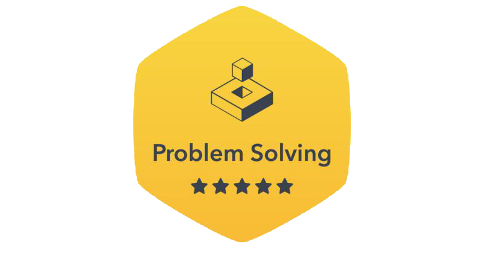

# Favorite Saying 👍

```rust
/// Pantom-007's motto
struct BillGates;

impl BillGates {
  /// Return Bill Gates quote
  fn said(&self) -> &str {
    "Measuring programming progress by lines of codes \
    is like measuring aircraft building progress by weight."
  }
}

fn main() {
  let bill_gate = BillGate;

  println!("Bill Gates - {}", bill_gate.said());
}
```


# Rust Engineer  
<div id='profile-them' style='display: flex; flex-wrap: wrap; justify-content: center;' align='center'>
  <a target="_blank" href="https://github.com/xfactor-toml/rust-coding-challenges">
    
  </a>

  <a target="_blank" href='https://www.hackerrank.com/profile/Pantom-007'>
    
  </a>
</div>

<div align="center"> 

